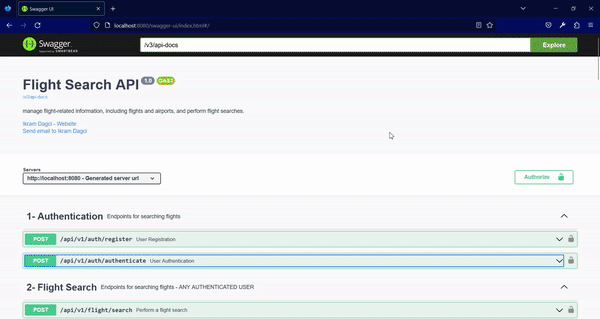

# Flight Explorer

This repository contains a Flight Explorer API, which includes a Spring Boot-based Flight Search API and a Mock API Server that simulates an external API. The Flight Search API provides comprehensive flight information, while Mock API Server generates random flight data with departure dates within the next 365 days. The Flight Search API periodically sends requests to the Mock API Server at specified intervals.

## Prerequisites

Before you begin, ensure you have the following requirements:

- Docker installed on your machine.

## Getting Started

1. Clone this repository to your local machine:

   ```bash

   git clone https://github.com/ikramdagci/FlightExplorer.git

   ```

2. Navigate to the project directory:

   ```bash
   cd FlightExplorer
   ```

3. Build and run the services using Docker Compose:

   ```bash
   docker-compose up --build
   ```

   This will start the Flight Search API, the Mock API Server, a PostgreSQL database, and a Redis instance.

4. The PostgreSQL service will automatically execute the init_db.sql script during initialization. This script is responsible for creating the initial database schema and inserting sample data.

5. Redis server is used for caching purposes in the application.

6. The Flight Search API will be available at `http://localhost:8080`. You can access its Swagger documentation at `http://localhost:8080/swagger-ui/index.html`

7. The Mock API Server will be available at `http://localhost:3000/flight` for single flight and `http://localhost:3000/flights/{flightCount}` for multi flights.

8. The application periodically sends scheduled requests to the Mock API Server to retrieve flight data and stores it in the database. The scheduling interval can be configured in the application.yaml file.

## Configuration

- The Flight Search API uses a PostgreSQL database for data storage. You can modify the database configuration in the `application.yaml` file within the flight-search-api directory.

- **Scheduled Cron Period**: You can specify the scheduled cron period for sending requests to the Mock API Server. Edit the `application.yaml` file and set the `api.flight.fetch.cron` property. For example, to run the task every 3 minutes:

```yaml
api:
  flight:
    fetch:
      cron: 0 */3 * * * *
```

- **Number of Flights Per Mock Request**: Determine how many flight data entries should be retrieved from the Mock API Server in a single request. Modify the `api.flight.fetch.count` property in the `application.yaml` file

```yaml
api:
  flight:
    url: http://mock-flight-api:3000
    fetch:
      count: 20
```

- **Redis Cache Time-to-Live (TTL)**: You can configure the time-to-live (TTL) for the data stored in the Redis cache. Set the `spring.data.redis.ttl` property in the `application.yaml` file. The value is specified in minutes:

```yaml
spring:
  data:
    redis:
      ttl: 60 # Cache data will expire after 60 minutes
```

- The Mock API Server is located in the mock-flight-api directory. You can customize it by editing the `flight-generator.js` file.

## Used Technologies

This project utilizes the following technologies:

- Docker
- Java 17
- Spring Boot 3.1.3
- HTTP Interfaces
- Hibernate ORM
- PostgreSQL
- Express.js
- Redis
- Lombok

## Usage

- Use the Flight Search API to perform flight searches and retrieve flight information. You can explore and interact with the API using [Swagger UI](http://localhost:8080/swagger-ui/index.html).

## User Authentication

This application offers two types of user authentication roles: USER and ADMIN.

### Admin User

#### Admin User Login

For development purposes, an admin user can log in either through the Swagger UI using the following credentials:

- Email: `admin@admin.com`
- Password: `admin`

Or, you can make a curl request as shown below:

```bash
curl -X 'POST' \
  'http://localhost:8080/api/v1/auth/authenticate' \
  -H 'accept: */*' \
  -H 'Content-Type: application/json' \
  -d '{
  "email": "admin@admin.com",
  "password": "admin"
}
```

This will authenticate the admin user and provide an authentication `token`

### Access Control Based on User Roles

- **USER Users**: Users with the USER role can only access the `search` service provided by `Flight Search`.

- **ADMIN Users**: Users with the ADMIN role can access all services.

- **Unauthorized Users**: Unauthorized (not logged in) users can only make requests to the `register` and `authenticate` services provided by `Authentication`.

### Using JWT Tokens

Upon logging in, you can use the JWT obtained from the `register` or `authenticate` services to access other services. In the Swagger UI, there is a button in the top right corner labeled "Authorize" or "Authentication," where you can add the token as a Bearer token to HTTP requests. This token allows you to determine your access permissions.

```plaintext
Bearer eyJhbGciOiJIUzI1NiIsInR5cCI6IkpXVCJ9...
```

After obtaining the token, you can add it to relevant HTTP requests in the Swagger UI, enabling you to perform authorization-related tasks.



## Cleanup

To stop and remove the Docker containers, run:

```bash
docker-compose down
```
